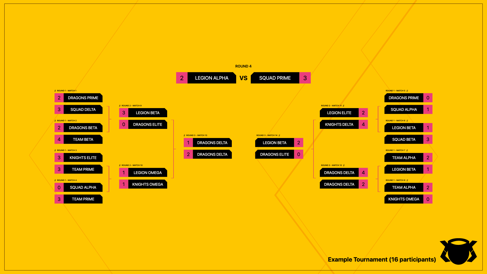

# Tournament Bracket Generator

A React-based tournament bracket visualization and export system, designed to work alongside the Divide Cup Discord Bot. This project generates high-quality tournament bracket images for esports competitions.

## Example Output

<p align="center">
  
  
  
  
</p>

## Features

- **Dynamic Bracket Visualization**
  - Support for various tournament sizes (4, 8, 16, 32 teams)
  - Automatic scaling based on bracket size
  - Clean and modern design
  - Custom background image support
  - Custom team colors and branding

- **Export Capabilities**
  - High-resolution PNG export (1920x1080)
  - Background customization
  - Automatic sizing and scaling
  - Server-side rendering for consistency

- **Integration Features**
  - REST API for bracket generation
  - Docker containerization
  - Automatic deployment workflow
  - Seamless Discord bot integration

## Technology Stack

- React 18 with TypeScript
- Vite for development and building
- Tailwind CSS for styling
- Express.js for the API server
- Puppeteer for image generation
- Docker for containerization
- GitHub Actions for CI/CD

## Getting Started

### Prerequisites

- Node.js v18+
- Docker and Docker Compose
- Git

### Local Development

1. Clone the repository
```bash
git https://github.com/cgarrot/divide_cups_front.git
cd divide_cups_front
cp .env.default .env
```


2. Install dependencies
```bash
npm install
```


3. Start the development server
```bash
npm run dev
```

4. Start the API server
```bash
cd server
npm install
npm start
```

### Docker Deployment

1. Build and run with Docker Compose
```bash
docker compose up -d
```

## API Usage

### Generate Tournament Bracket

```typescript
POST /export-bracket

{
  "name": "Tournament Name",
  "rounds": [
    {
      "round": 1,
      "matches": [
        {
          "match": 1,
          "team1": "Team A",
          "team2": "Team B",
          "score1": 2,
          "score2": 1
        }
        // ... more matches
      ]
    }
    // ... more rounds
  ]
}
```

## Project Structure

- `/src` - React application source code
- `/server` - Express.js API server
- `/components` - React components for bracket visualization
- `/docker` - Docker configuration files
- `/.github/workflows` - CI/CD configuration

## Related Projects

- [Divide Cup Discord Bot](https://github.com/yourusername/divide-cup) - Main Discord bot for tournament management
